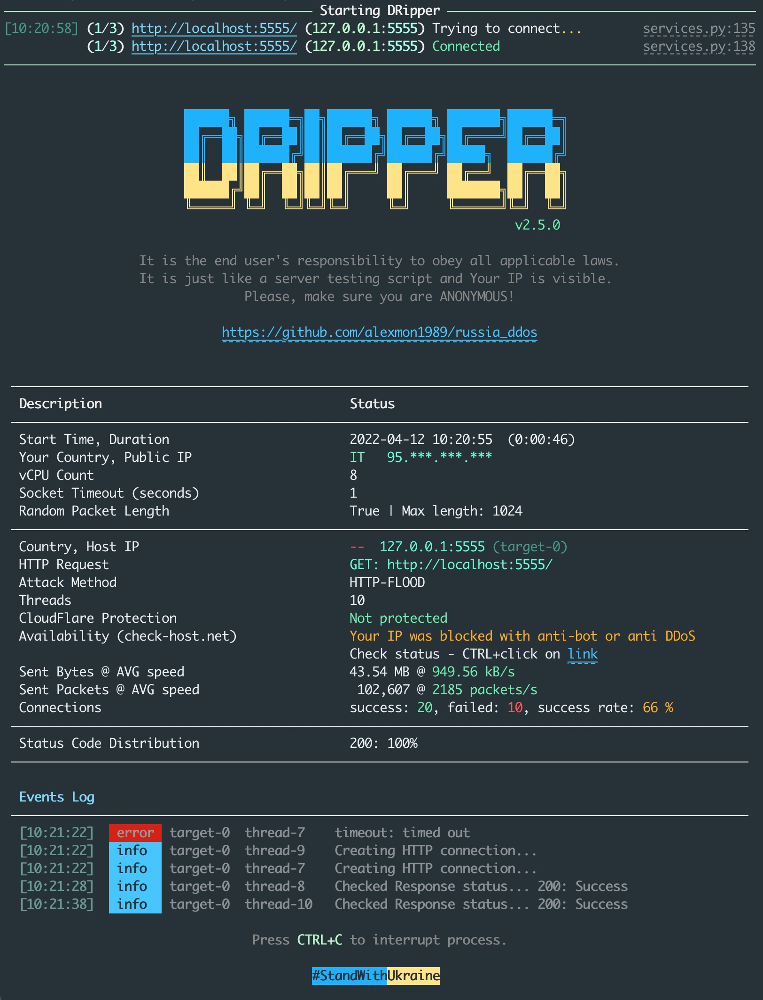

# DRipper інструкція користувача

**DRipper** - скорочено від DDoS Ripper. За основу DRipper спочатку було взято скрипт DDoS Ripper, 
який було оптимізовано, а потім повністю переписано для того, щоб досягти максимальної ефективності та інформативності. 
Розробники скрипта DRipper – це українці!

**DRipper** - це скрипт для тестування власних сервісів користувача на рівень стійкості до DDoS атак. 
Користувач має змогу оцінити (протестувати) свої власні сервіси на рівень стійкості (захисту) від DDoS атак. 
На основі результатів тесту і логів DRipper користувач має змогу покращити захист своїх власних сервісів.



---

## Основні властивості DRipper

#### Одночасна робота скрипта по багатьох цілям.
Скрипт може одночасно атакувати різні цілі різними методами. Підтримуються методи **tcp/udp/http flood**. 
Для цього потрібно лише передати набір цілей у форматі `{scheme}://{hostname}[:{port}][{path}]`.

> Наприклад: tcp://site1.com:80, або udp://site2.com:53, або http://site3.com:80, або https://site4.com:443

#### Автоматична перевірка нових версій DRipper.

Як тільки з'являється нова версія DRipper, скрипт про це повідомить. Функція перевірки оновлення доступна, починаючи з версії **2.5.0**

#### Детальна статистика по кожній цілі

По кожній цілі ведеться окрема статистика, яка показує:

- Код країни та IP адреса сервера
- Поточний метод атаки
- Кількість потоків, які працюють по цій конкретній цілі (в режимі роботи по багатьох цілям потоки розподіляються по цілях рівномірно при старті скрипта)
- Інформація про те, чи знаходиться сервер під захистом CloudFlare від DDoS атак
- Інформація від **check-host.net** сервіса по доступності цілі
- Інформація по кількості відправлених даних і середньої швидкості даних
- Інформація по кількості відправлених пакетів і середньої швидкості пакетів з даними
- Інформація по успішному/неуспішному з'єднанню з сервісом
- Розподілена статистика по кодам відповіді сервіса (для http атак)
- Детальний журнал подій по всім цілям і процесам

```
  Country, Host IP                            --  127.0.0.1:8070 (target-0)
  Attack Method                               UDP-FLOOD
  Threads                                     200
  CloudFlare Protection                       Not protected
  Availability (check-host.net)               Your IP was blocked with anti-bot or anti DDoS
                                              Check status - CTRL+click on link
  Sent Bytes @ AVG speed                      189.98 MB @ 1.20 MB/s
  Sent Packets @ AVG speed                      388,334 @ 2453 packets/s
  Connections                                 success: 200, failed: 0, success rate: 100 %
 ─────────────────────────────────────────────────────────────────────────────────────────────

  Events Log
 ─────────────────────────────────────────────────────────────────────────────────────────────
  [11:54:59]   info   target-0  thread-195  Creating new UDP connection...
  [11:54:59]   info   target-0  thread-193  Creating new UDP connection...
  [11:54:59]   info   target-0  thread-199  Creating new UDP connection...
  [11:55:00]   info   target-0  thread-197  Creating new UDP connection...
  [11:55:00]   info   target-0  thread-198  Creating new UDP connection...
```

#### Перевірка доступності цілі за допомогою зовнішнього сервісу (check-host.net)

Для кожної цілі автоматично через певний проміжок часу виконується запит на перевірку доступності цілі за допомогою 
зовнішнього сервісу. Така перевірка в автоматичному режимі допомагає зрозуміти, чи ціль ще жива та відповідає, чи вже ні.

**check-host** сервіс може обмежувати доступ до свого ресурсу за допомогою CloudFlare anti-bot 
і перевірка скриптом в автоматичному режимі може не працювати. 
**DRipper** автоматично визначає такий захист і не намагається більше виконувати 
перевірку для того, щоб не отримати BAN і Вашу ІР не заблокували повністю. 
В такому випадку замість результатів перевірки з'являється повідомлення з прямим посиланням (hyperlink) для переходу 
на сторінку перевірки за допомогою браузера.

#### Перевірка цілей на захист від DDoS від CloudFlare

Кожна ціль перевіряється на захист від DDoS за допомогою CloudFlare. Оскільки атака на сервіс, який знаходиться 
за CloudFlare anti DDoS не буде ефективною, то перевірка на початку атаки повідомить Вам про це і дасть змогу приймати рішення щодо подальших дій.

Також **DRipper** для атаки **http-flood** аналізує відповіді та помилки від сервера, серед яких, 
якщо будуть ознаки Rate limit (обмеження на кількість запитів за одиницю часу), 
anti-DDoS - скрипт повідомить про це і вчасно зупинить атаку для того, щоб запобігти блокуванню вашої публічної ІР адреси.

#### Перевірка на Rate Limits

Скрипт автоматично перевіряє у фоновому режимі доступність цілі саме з Вашого публічного IP для того, 
щоб оперативно відстежувати блокування й обмеження, які можуть з'явитися під час атаки. 
Одне з таких обмежень - це ліміти на кількість запитів з одної ІР адреси. 
У випадку, коли сервіс має такі механізми - **DRipper** повідомить про це в **Events log**, що дасть Вам змогу приймати 
рішення щодо подальших тому, що така атака вже не є ефективною.

#### Автоматична перевірка VPN з'єднання

Під час роботи скрипта періодично йде перевірка зовнішньої ІР адреси і якщо ІР змінився з початку запуску скрипта, то **DRipper** повідомить про це.

#### Генератор команд для запуску скрипта, якщо користувач помилився з аргументами команди

Починаючи з версії скрипта **2.5.0**, якщо користувач помилився з командою, окрім повідомлення про помилку 
буде ще й список команд для всіх атак, з яких можна обрати готову команду і запустити скрипт.

```
python3 DRipper.py -t 200 --log-level info -s udp://localhost:8070 -m tcp
╭──────────────────────────────────────────────────────────────────────────────────────────────────╮
│ Wrong attack type. Check param -m (--method) tcp                                                 │
│ Possible options: udp-flood, tcp-flood, http-flood, http-bypass                                  │
╰──────────────────────────────────────────────────────────────────────────────────────────────────╯
TCP-FLOOD attack:
dripper -t 100 -r 1 -l 1024 -s tcp://localhost:8070

python  DRipper.py -t 100 -r 1 -l 1024 -s tcp://localhost:8070
python3 DRipper.py -t 100 -r 1 -l 1024 -s tcp://localhost:8070

docker run -it --rm alexmon1989/dripper:2.5.0 -t 100 -r 1 -l 1024 -s tcp://localhost:8070

UDP-FLOOD attack:
dripper -t 100 -r 1 -l 1024 -s udp://localhost:8070

python  DRipper.py -t 100 -r 1 -l 1024 -s udp://localhost:8070
python3 DRipper.py -t 100 -r 1 -l 1024 -s udp://localhost:8070

docker run -it --rm alexmon1989/dripper:2.5.0 -t 100 -r 1 -l 1024 -s udp://localhost:8070

HTTP-FLOOD attack:
dripper -t 100 -e GET -s http://localhost:8070

python  DRipper.py -t 100 -e GET -s http://localhost:8070
python3 DRipper.py -t 100 -e GET -s http://localhost:8070

docker run -it --rm alexmon1989/dripper:2.5.0 -t 100 -e GET -s http://localhost:8070
```

---

## Команди DRipper

Для того, щоб атакувати ціль, достатньо мінімальних базових знань в галузі Web-технологій.

Скрипт працює на операційних системах Linux, macOS, Windows. Для запуску скрипта потрібен **Python** >= 3.9 версії або Docker.

Розглянемо на прикладі як створити команду для запуску скрипта, якщо у Вас є в наявності деякий список цілей.

```bash
# Приклад списку цілей:

https://site1.tv
111.22.33.444 (80/tcp, 443/tcp, 53/udp)

https://www.site2.ru
222.33.444.555 (25/tcp, 80/tcp, 443/tcp)
333.33.555.678 (25/tcp, 80/tcp, 443/tcp)

http://www.site3.com
```

На основі вище вказаного списку, можемо створити команди для атак різних типів, 
наприклад для сайта `https://site1.tv` і `https://www.site2.ru` відомі ІР адреси і порти. 
Для них дуже легко створити команду для атаки. А для `http://www.site3.com` - немає ніякої додаткової інформації, 
тому створимо для цього ресурсу всі можливі варіанти.

```bash
# Приклад атак на основі списку цілей:

# Ціль 1
# https://site1.tv
# 111.22.33.444 (80/tcp, 443/tcp, 53/udp)

# Атака 1
python3 DRipper.py -t 300 \
    -s tcp://111.22.33.444:80 \
    -s tcp://111.22.33.444:443 \
    -s udp://111.22.33.444:53
```

Для атаки на 3-й варіант, можна використати тільки назву сайта, а метод атаки додати перед назвою. 
Звісно, треба розуміти, що така атака імовірніше не буде ефективною, тому, що невідомо які порти відкрито назовні, які методи захисту є у сайта і т.і.

```bash
# Ціль 3
# http://www.site3.com

# Атака 3
python3 DRipper.py -t 300 \
    -s tcp://www.site3.com \
    -s udp://www.site3.com \
    -s http://www.site3.com
```

---

## Статистика DRipper

Розглянемо результати атаки **http-flood** для одної цілі й розберемось з тим, що саме показує статистика.

```bash
──────────────────────────────────────────────────────────────────────────────────────────────────
  Description                                 Status
 ──────────────────────────────────────────────────────────────────────────────────────────────────
  Start Time, Duration                        2022-04-10 17:11:56  (0:00:52)
  Your Country, Public IP                     NL   89.***.***.***
  vCPU Count                                  8
  Socket Timeout (seconds)                    60
  Random Packet Length                        True | Max length: 1024
 ──────────────────────────────────────────────────────────────────────────────────────────────────
  Country, Host IP                            RU  91.222.33.444:443 (target-0)
  HTTP Request                                GET: https://www.site1.ru:443/
  Attack Method                               HTTP-FLOOD
  Threads                                     200
  CloudFlare Protection                       Not protected
  Availability (check-host.net)               [17:12:12] Accessible in 19 of 21 zones (90%)
  Sent Bytes @ AVG speed                      33.21 MB @ 646.59 kB/s
  Sent Packets @ AVG speed                      77,187 @ 1467 packets/s
  Connections                                 success: 180, failed: 120, success rate: 60 %
 ──────────────────────────────────────────────────────────────────────────────────────────────────
  Status Code Distribution                    200: 100%
 ──────────────────────────────────────────────────────────────────────────────────────────────────

  Events Log
 ──────────────────────────────────────────────────────────────────────────────────────────────────
  [17:12:49]   info   target-0  thread-7    Creating HTTP connection...
  [17:12:49]   error  target-0  thread-197  BrokenPipeError: [Errno 32] Broken pipe
  [17:12:49]   error  target-0  thread-9    BrokenPipeError: [Errno 32] Broken pipe
  [17:12:49]   info   target-0  thread-9    Creating HTTP connection...
  [17:12:49]   info   target-0  thread-197  Creating HTTP connection...
```

- **Country, Host IP**

    Тут код країни `RU` та ІР адреса цілі `91.222.33.444:443`. Також є ідентифікатор цілі `(target-0)`, за яким 
    можна зрозуміти яка подія в **Events log** стосується цілі.

- **HTTP Request**

    HTTP method і адреса на яку скрипт відправляє пакети (запити). Для tcp-flood, udp-flood атак цього пункта в статистиці немає.

- **Attack Method**

    Назва методу атаки, наприклад: TCP-FLOOD, UDP-FLOOD, HTTP-FLOOD.

- **Threads**
    
    Кількість потоків з яких йде атака. Потоки рівномірно розподіляються між цілями при старті скрипта. 
    Треба розуміти, що кількість потоків і ефективність використання цих потоків залежить від потужності Вашого ПК.

- **CloudFlare Protection**

    Інформація про те, че є CloudFlare захист на сайті (Not protected - немає, Protected - є захист)
    > У випадку коли є захист - атака буде закінчена автоматично для того, щоб Ваша ІР адреса не попала 
    до чорного списку ІР адрес на цьому сайті. Крім того, атака на сайт з захистом дуже не ефективна.
   
    Захист CloudFlare, якщо не заглиблюватись в деталі, працює приблизно наступним чином. 
    Перед сторінкою сайта наприклад це може бути головна сторінка сайту, додається сторінка CloudFlare, на якій є скрипт,
    що аналізує протягом 5 секунд кількість запитів з Вашої публічної ІР адреси та одночасно з цим генерує математичне
    рівняння, якє повинне бути обчислене за допомогою Вашого браузера за ці 5 секунд, що аналізуються. Коли користувач відкриває
    сторінку з таким захистом, то він бачить повідомлення про те що його браузер перевіряється і треба зачекати умовно 5 секунд.
    Після цього - користувач перенаправляється на сторінку, яку він запросив. Начебто все просто... логічним було б просто зачекати 5 секунд перед атакою,
    а потім вже атакувати такій ресурс. Але не все так просто.

    Для DDoS скрипта немає особливої складності розпізнати, що сторінка або сайт мають такий захист. Основна проблема полягає в тому,
    що потрібно отримати javascript код сторінки сайта, проаналізувати частини рівняння цього коду 
    (а CloudFlare постійно змінює ці частини коду і їх кількість), потім вирішити це рівняння і отримати контрольну сумму.
    Результат обчислення треба передати з наступним запитом DDoS пакета, записавши його в тому форматі (ідентифікатор - результат),
    що було закладено CloudFlare для цієї сторінки. Якщо таке завдання вирішити - CloudFlare перенаправить всі запити на цільовий ресурс.
    Але, якщо не вирішити завдання, або вирішити не вірно - доступ до ресурсу буде заблоковано. Але і це ще не все.
    Через декілька хвилин знову буде перевірка, але інакша, буде перевірятися кількість відправлених запитів 
    і якщо вона перевищить дозволену кількість - знову буде перевірка, як спочатку.

    Саме тому, атака на ресурси за CloudFlare не буде ефективною, так, як в процесі атаки треба буде вирішувати завдання,
    щоб обійти захист, чекати по 5 секунд для перевірки, потім робити паузи, щоб не перевищити ліміти по запитах.
    А ще треба зважити на те, що потрібен час розробників для постійного вдосконалення механізмів обходу захисту.
    Популярні бібліотеки для обходу такого захисту просто не встигають за тими змінами в алгоритмах захисту, що постійно
    змінюються у CloudFlare.

- **Availability (check-host.net)**

    Інформація про доступність сайта. Для перевірки використовуються сервери розміщені у різноманітних регіонах. 
    На момент написання даної інструкції доступні 21 регіон (Australia - Perth, Austria - Salzburg, Canada - Toronto, 
    France - Paris, Germany - Frankfurt, Hong Kong - Hong Kong, Iran - Tehran, Italy - Milan, Kazakhstan - Karaganda, 
    Lithuania - Vilnius, Moldova - Chisinau, Netherlands - Amsterdam, Portugal - Viana, Russia - Moscow, Russia - Moscow, 
    Switzerland - Zurich, Turkey - Istanbul, Ukraine - Khmelnytskyi, Ukraine - Kyiv, USA - Los Angeles, USA - New Jersey).

    `[17:12:12]` - час останньої перевірки
    
    `Accessible in 19 of 21 zones (90%)` - сайт доступний у 19 з 21 зони (регіон перевірки), 90% - це загальний відсоток доступності. 
    Коли відсоток стає менше 50% - це означає, що сайт майже не працює, тим самим підкреслює ефективність атаки.

    У випадку, коли на сайті **check-host.net** є захист CloudFlare від ботів, скрипт знаходить такий захист 
    і перестає надсилати періодичні запити для отримання доступності сайта, для того, щоб Ваша ІР адреса не була заблокована сервісом. 
    В такому випадку **DRipper** повідомить про це і надасть посилання для перевірки доступності цілі за допомогою браузера.

    Для переходу на сайт з перевіркою доступності цілі треба затиснути **CTRL** і натиснути на посилання *link*

    ```bash
    Availability (check-host.net)               Your IP was blocked with anti-bot or anti DDoS
                                                Check status - CTRL+click on link
    ```

- **Sent Bytes @ AVG speed**

    Статистика по об'єму даних, які було відправлено. `33.21 MB @ 646.59 kB/s` - означає, 
    що було всього відправлено 32.21 Мб з середньою швидкістю 646.59 kB/s.
    
    Під час атаки треба дивитися на загальний об'єм відправлених даних, вони повинні постійно зростати. 
    Якщо цей показник не збільшується, це означає, що данні не доходять до сервера. 
    Показник швидкості - це значення, яке вказує на середню швидкість передавання даних за весь проміжок часу. 
    Коли данні не передаються, то середня швидкість зменшується, а коли данні передаються, то цей показник або зростає, 
    або трохи змінюється відносно свого значення.

- **Sent Packets @ AVG speed**

    Статистика по об'єму пакетів з даними, що було передано. `77,187 @ 1467 packets/s` - означає, що всього було 
    відправлено 77.178 пакетів (або запитів) з середньою швидкістю 1467 packets/s (для http-flood одиниця виміру - requests/s). 
    На показники кількості пакетів і швидкості пакетів дивитися треба так само як вказано в поясненні до *Sent Bytes @ AVG speed*

- **Connections**

    Статистика по з'єднанню. `success: 180` - каже про те, що під час роботи скрипта було створено 180 вдалих з'єднань 
    з сервером для відправки даних. `failed: 120` - це кількість з'єднань, в яких виникла помилка, або таке з'єднання 
    було розірвано. `success rate: 60 %` - статистика у вигляді відсотків, яка показує співвідношення вдалих з'єднань до невдалих.

    Якщо кількість з'єднань з помилками росте дуже швидко, або майже дорівнює кількості вдалих з'єднань - це, наприклад, може свідчити 
    про можливі проблеми з VPN. В такому випадку варто замислитися над тим, щоб змінити VPN з'єднання і перезапустити атаку.

    З'єднання з помилками все одно будуть, бо неможливо взагалі уникнути помилок при відправці великої кількості пакетів 
    і даних, які властиві DDoS атакам. Тому треба розуміти, що важливо дивитись саме на динаміку того, що відбувається, 
    а не на абсолютні значення. Основне правило для з'єднань - вдалі з'єднання повинні збільшуватись слідом 
    за невдалими - це свідчить про те, що відбувається нове з'єднання і скрипт продовжує атакувати.

    Success rate також треба розуміти, як орієнтовний показник, який може бути як 100%, так і 50%. І в обох випадках це нормальний показник,
    який просто показує наскільки якісний зв'язок. Якщо за весь час роботи скрипта не було жодних проблем із з'єднанням, то
    відсоток **Success rate** буде 100% і це просто ідеальний випадок. Але й коли було 10 невдалих з'єднань, то скрипт зробить 11-те вдале і продовжить
    працювати - **Success rate** буде 52% і це також гарний показник. Просто порівняно з ідеальним з'вязком - цей випадок з помилками
    з'єднання виглядає саме так з математичної точки зору.

- **Status Code Distribution**

    Розподілена статистика по статус-кодам відповідей сервера. Що таке статус-коди і який статус що означає, 
    детальніше можна почитати на [Wikipedia](https://uk.wikipedia.org/wiki/%D0%A1%D0%BF%D0%B8%D1%81%D0%BE%D0%BA_%D0%BA%D0%BE%D0%B4%D1%96%D0%B2_%D1%81%D1%82%D0%B0%D0%BD%D1%83_HTTP).
    `200: 100%` - вказує на те, що всі запити отримані сервером, оброблені. Це свідчить про успішне виконання HTTP запиту.

    DRipper не збирає статистику по кожному запиту, бо це б погано впливало на ефективність атаки. Тому, скрипт періодично
    перевіряє одну із відповідей (приблизно раз в 10 секунд) і формує статистику.

- **Events log**

    Журнал подій, в якому видно деталі того, що відбувається з усіма цілями. 
    Тут багато службової інформації, що може бути корисною для тих, хто розуміється на деталях роботи протоколів TCP/UDP.

    Але, крім деталей роботи протоколів, ще є корисна інформація про можливі помилки, які можуть виникнути під час атаки. 
    Наприклад, Вашу ІР адресу можуть заблокувати в ручному режимі під час атаки і Ви це ніяк не можете передбачити. 
    Якщо такє трапиться, то в журналі подій про це буде повідомлено у вигляді помилки з деталями про те, 
    в якому потоці це відбулось і до якої цілі це відноситься.

    На прикладі нижче, є два повідомлення, одне з рівнем `info`, інше з рівнем `error`. 
    Рівень `info` містить багато повідомлень, які вказують на те, що відбувається з процесами атаки. 
    За замовчуванням цей рівень не активний - в журналі подій будуть показань тільки рівні `warn` та `error`.

    ```bash
    [17:12:49]   info   target-0  thread-7    Creating HTTP connection...
    [17:12:49]   error  target-0  thread-197  BrokenPipeError: [Errno 32] Broken pipe
    ```
    
    Рівень `warn` - попереджує користувача про якісь події, що впливають на ефективність атаки або належать до попереджень 
    щодо вашої приватності (статус VPN, тощо...), або наприклад про Rate limits (коли сервер обмежує кількість запитів), про блокування ІР і т.і.

    Рівень `error` - інформує про помилки, які виникли під час атаки. Здебільшого всі помилки опрацьовані і повідомлення 
    про помилки несе більш інформативний характер, який допомагає зрозуміти що саме пішло не так.
    
    Наприклад `timeout error` - коли виникає багато помилок такого типу, це означає, що сервер може бути перевантажений 
    і не встигає відповісти за певний час. Тому, помилка такого типу може стати нам як підказка для того, 
    щоб збільшити параметр `timeout` для скрипта за допомогою додавання параметру `-o 30`, або `-o 60` 
    (timeout 30 або 60 секунд, відповідно) до команди запуску скрипта.

    Багато помилок може бути таких, як `BrokenPipeError`. Такі помилки виникають при великій кількості запитів, 
    але скрипт розуміє такі помилки і просто закриває старе з'єднання і створює нове, продовжуючи роботу потоку для цієї атаки.

    Кількість рядків, яка одночасно відтворюється для **Events log** може буде встановлена користувачем за допомогою 
    параметра `--log-size=N`, де N - кількість рядків.

    Рівень повідомлень в **Events log** може буди встановлений за допомогою параметра `--log-level=info`, 
    де `info` - це найнижчий рівень повідомлень, а `warn`, `error` - наступні за рівнем важливості. 
    Також можна взагалі вимкнути журнал повідомлень за допомогою параметра `--log-level=none`
